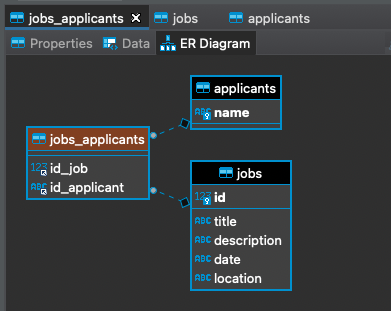

# Job Board

## :pushpin: Objectives of the project

* Write a script to read the CSV file(jobs.csv) and store the data in a structured way.

* Users should be able to view a list of jobs with title, location and date.

* Users should be able to click on a job to view more details about it.

## :books: Reference documentation

* Lumen: https://lumen.laravel.com/docs/8.x/testing#testing-json-apis
* Laravel: https://laravel.com/docs/8.x/testing

## :camera_flash: Job Board - usage instructions

### Data Relation Structure

### Technologies and Dependencies
* PHP Lumen
* ReactJs - Dependencies (axios, prettier, react-loading, react-router-dom, styled-components)

## Setup
* Install [Docker](https://docs.docker.com/get-started/)

### Clone the repository
* $ `git clone https://github.com/FelipeCostaBR/Job-Board.git`
* $ `cd Job-Board`
   
### Build and Run
* $ `docker-compose build`
* $ `docker-compose up`
* the commands above can take a few minutes.

* Open a new terminal and go into the project folder

### Insert data into the database
* **The CSV file needs to be into - ** Job-Board/backend/storage/app

* $ `docker-compose exec coding-challenge-backend php artisan migrate`
* Do you really wish to run this command? (yes/no) [no]:
* $ type: `yes` 
* $ `docker-compose exec coding-challenge-backend php artisan db:seed`
* Do you really wish to run this command? (yes/no) [no]:
* $ type: `yes`

### Open the browser and access the localhost to use the application
* React frontend: http://localhost/jobs

## Tests
* $ `cd Job-Board/backend`
* $ `./vendor/bin/phpunit`

